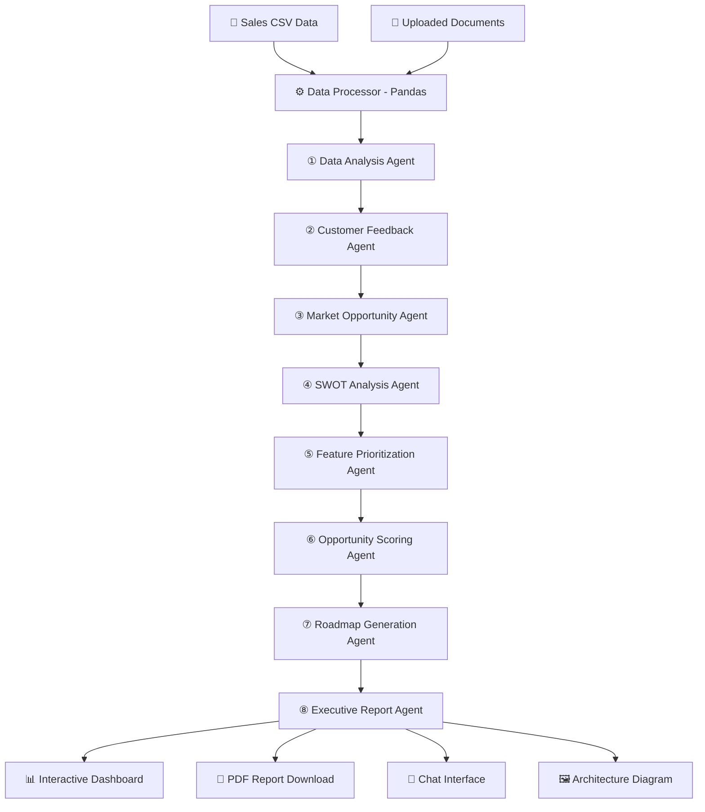

# AI-Powered Product Strategy Assistant

**Live App:** https://sampy-3jhr.onrender.com/

A multi-agent AI system that helps Product Managers transform raw sales data into actionable strategic insights using 8 specialised GPT-4o Mini agents.

---

## Architecture



---

## Features

| Feature | Description |
|---|---|
| 8-Agent Pipeline | Sequential agents each building on prior context |
| Data Analysis | Revenue, profit, regional and trend breakdowns |
| Customer Feedback Analysis | Sentiment themes from review text |
| Market Opportunity Detection | Under-served segments and growth plays |
| SWOT Analysis | Data-grounded Strengths / Weaknesses / Opportunities / Threats |
| Feature Prioritization | MoSCoW framework with quick-win list |
| **Opportunity Scoring** | Per-product scores (1–10) with Invest/Maintain/Divest recommendations |
| **Product Roadmap** | Quarterly 4-quarter roadmap with KPIs |
| Executive Report | C-suite-ready 30-60-90 day action plan |
| Interactive Dashboards | Plotly charts for revenue, profit, category, region |
| PDF Report Download | Branded multi-page executive report |
| Architecture Diagram | Downloadable PNG system diagram |
| Pipeline Monitor | Token usage and timing per agent |
| Chat Interface | Follow-up Q&A grounded in all analysis |

---

## Tech Stack

- **Frontend**: Streamlit
- **AI Model**: OpenAI GPT-4o Mini
- **Data Processing**: Pandas
- **PDF Generation**: FPDF2
- **Charts**: Plotly Express
- **Architecture Diagram**: Matplotlib
- **Config**: python-dotenv

---

## Quick Start

### 1. Clone / download the project

```bash
git clone <your-repo-url>
cd Assessment
```

### 2. Install dependencies

```bash
pip install -r requirements.txt
```

### 3. Configure API key

Copy `.env.example` to `.env` and add your key:

```
OPENAI_API_KEY=sk-your-key-here
```

### 4. Run the app

```bash
streamlit run app.py
```

The app auto-loads `Sample Sales Data.csv`. Click **Run Full Analysis** to start the 8-agent pipeline.

---

## Project Structure

```
Assessment/
├── app.py                     # Streamlit UI (8 tabs, chat, downloads)
├── agents.py                  # 8 GPT-4o-mini agents + monitoring
├── data_processor.py          # CSV statistics and context builder
├── report_generator.py        # PDF report (FPDF2)
├── architecture_diagram.py    # PNG architecture diagram (matplotlib)
├── requirements.txt
├── .env                       # OPENAI_API_KEY (not committed)
├── .env.example
└── Sample Sales Data.csv      # Demo dataset
```

---

## Agent Descriptions

| # | Agent | Role |
|---|---|---|
| 1 | Data Analysis | Revenue trends, product performance, regional insights |
| 2 | Customer Feedback | Sentiment analysis on review text |
| 3 | Market Opportunity | Growth segments and expansion strategies |
| 4 | SWOT Analysis | Strengths, Weaknesses, Opportunities, Threats |
| 5 | Feature Prioritization | MoSCoW framework + quick wins |
| 6 | Opportunity Scoring | Per-product scoring matrix (1–10) |
| 7 | Roadmap Generation | Quarterly Q1–Q4 roadmap with KPIs |
| 8 | Executive Report | 30-60-90 day action plan for leadership |

---

## Deployment

### Render (Recommended)

1. Push code to a GitHub repo
2. Create a new **Web Service** on [render.com](https://render.com)
3. Set **Build Command**: `pip install -r requirements.txt`
4. Set **Start Command**: `streamlit run app.py --server.port $PORT --server.address 0.0.0.0`
5. Add environment variable: `OPENAI_API_KEY=sk-…`

### Railway

1. Push to GitHub
2. Create new project → **Deploy from GitHub**
3. Set start command: `streamlit run app.py --server.port $PORT --server.address 0.0.0.0`
4. Add `OPENAI_API_KEY` in Variables

---

## Submission Checklist

- [x] Source code repository
- [x] Live application URL — https://sampy-3jhr.onrender.com/
- [x] Architecture diagram (downloadable from app)
- [x] Sample generated PDF report (download from app after analysis)
- [x] Project documentation (this README)

---

## Evaluation Criteria Coverage

| Criterion | Weight | How addressed |
|---|---|---|
| Successful Deployment | 30% | Render/Railway deploy instructions above |
| Quality of AI Insights | 35% | 8 specialised agents with deep prompts; Opportunity Scoring; Roadmap |
| Multi-Agent Design & UX | 35% | Sequential 8-agent pipeline; Pipeline Monitor; 8 result tabs; Chat |

### Bonus Features Implemented
- **Product Opportunity Scoring** — Agent 6 scores each product 1–10 on 4 dimensions
- **Roadmap Generation** — Agent 7 produces a full Q1–Q4 roadmap
- **Interactive Dashboards** — 4 Plotly charts (revenue, category, region, trend)
- **Evaluation & Monitoring** — Pipeline Monitor shows tokens and timing per agent
- **Architecture Diagram Download** — Matplotlib PNG available in the app
